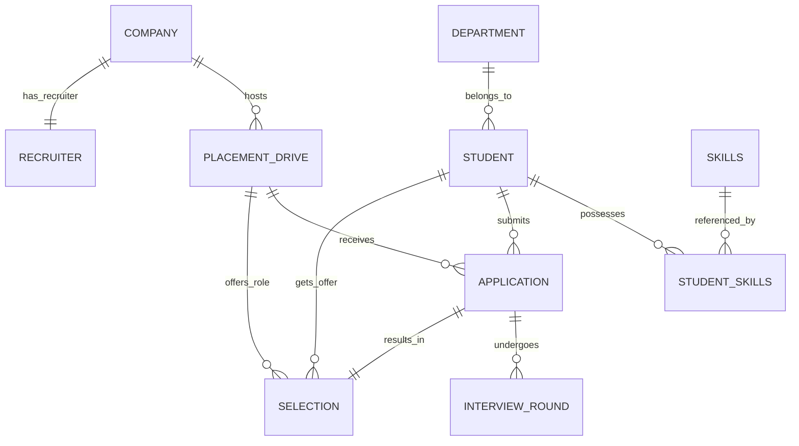

# Implementation Plan - Smart Placement & Recruitment Management System (SPaRMS)

This document describes the technical architecture, database schema, package design, and layout plan for developing the **Smart Placement & Recruitment Management System (SPaRMS)**.

## Goal Description

SPaRMS is a centralized, secure, desktop-based recruitment platform tailored for universities and HR departments. It automates student profile management, placement drive scheduling, recruiter-student communication, application tracking, interview scheduling, and placement reports, replacing manual paper/spreadsheet tracking with robust database automation.

The design uses a clean **3-Tier Architecture** (Presentation, Business Logic, Data Access) using **Java Swing** with the modern **FlatLaf** corporate look-and-feel, and **JDBC** to connect to a **MySQL database** configured in **Third Normal Form (3NF)**.

---

## Technical Stack & Configuration

- **Language:** Java 17
- **Database:** MySQL 8.0 (running on port 3306, user `root`, password `Indira@0201`)
- **Libraries (placed in `/lib`):**
  - MySQL Connector/J (`mysql-connector-j-8.0.33.jar`)
  - FlatLaf Modern Look & Feel (`flatlaf-3.1.1.jar`)
- **Compile & Run Commands:**
  - Compile: `javac -cp "lib/*" -d bin (Get-ChildItem -Path src -Filter *.java -Recurse | Select-Object -ExpandProperty FullName)`
  - Run: `java -cp "bin;lib/*" main.Main`

---

## User Review Required

> [!IMPORTANT]
> **Database Credentials & Schema Initialization**
> - The database credentials are configured as `root` with password `Indira@0201`.
> - During System Initialization, the application will automatically connect to MySQL, check if the `sparms_db` database exists, and if not, create the database and all its tables and seed standard lookup data (such as Departments, Skills, and a default Admin login).

---

## Database Design (3NF Normalized Schema)

The database will be named `sparms_db`. Here is the proposed schema layout.



### Table Structure

1. **`departments`** (Stores academic departments)
   - `id` INT AUTO_INCREMENT PRIMARY KEY
   - `name` VARCHAR(100) UNIQUE NOT NULL (e.g., Computer Science, Electrical Engineering)

2. **`admins`** (Stores system administrator credentials)
   - `id` INT AUTO_INCREMENT PRIMARY KEY
   - `username` VARCHAR(50) UNIQUE NOT NULL
   - `password` VARCHAR(255) NOT NULL (hashed for security)
   - `email` VARCHAR(100) UNIQUE NOT NULL
   - `name` VARCHAR(100) NOT NULL

3. **`companies`** (Stores company details)
   - `id` INT AUTO_INCREMENT PRIMARY KEY
   - `name` VARCHAR(100) UNIQUE NOT NULL
   - `website` VARCHAR(255)
   - `industry` VARCHAR(100)
   - `description` TEXT

4. **`recruiters`** (Stores recruiter login and company mapping)
   - `id` INT AUTO_INCREMENT PRIMARY KEY
   - `username` VARCHAR(50) UNIQUE NOT NULL
   - `password` VARCHAR(255) NOT NULL
   - `email` VARCHAR(100) UNIQUE NOT NULL
   - `name` VARCHAR(100) NOT NULL
   - `company_id` INT NOT NULL, FOREIGN KEY REFERENCES `companies`(`id`) ON DELETE CASCADE

5. **`students`** (Stores student profile and academic details)
   - `id` INT AUTO_INCREMENT PRIMARY KEY
   - `roll_number` VARCHAR(50) UNIQUE NOT NULL
   - `username` VARCHAR(50) UNIQUE NOT NULL
   - `password` VARCHAR(255) NOT NULL
   - `email` VARCHAR(100) UNIQUE NOT NULL
   - `name` VARCHAR(100) NOT NULL
   - `phone` VARCHAR(20)
   - `department_id` INT, FOREIGN KEY REFERENCES `departments`(`id`) ON DELETE SET NULL
   - `cgpa` DECIMAL(4,2) NOT NULL DEFAULT 0.00
   - `tenth_percentage` DECIMAL(5,2) NOT NULL DEFAULT 0.00
   - `twelfth_percentage` DECIMAL(5,2) NOT NULL DEFAULT 0.00
   - `active_backlogs` INT NOT NULL DEFAULT 0
   - `resume_url` VARCHAR(255)

6. **`skills`** (Master skills directory)
   - `id` INT AUTO_INCREMENT PRIMARY KEY
   - `name` VARCHAR(100) UNIQUE NOT NULL

7. **`student_skills`** (Join table mapping students to skills - composite primary key)
   - `student_id` INT, FOREIGN KEY REFERENCES `students`(`id`) ON DELETE CASCADE
   - `skill_id` INT, FOREIGN KEY REFERENCES `skills`(`id`) ON DELETE CASCADE
   - PRIMARY KEY (`student_id`, `skill_id`)

8. **`placement_drives`** (Job recruitment drive specifications)
   - `id` INT AUTO_INCREMENT PRIMARY KEY
   - `company_id` INT NOT NULL, FOREIGN KEY REFERENCES `companies`(`id`) ON DELETE CASCADE
   - `title` VARCHAR(150) NOT NULL
   - `job_role` VARCHAR(100) NOT NULL
   - `job_description` TEXT
   - `package_lpa` DECIMAL(5,2) NOT NULL
   - `min_cgpa` DECIMAL(4,2) NOT NULL DEFAULT 0.00
   - `max_backlogs` INT NOT NULL DEFAULT 0
   - `drive_date` DATE NOT NULL
   - `status` VARCHAR(20) NOT NULL DEFAULT 'UPCOMING' -- UPCOMING, ONGOING, COMPLETED, CANCELLED

9. **`applications`** (Student job applications)
   - `id` INT AUTO_INCREMENT PRIMARY KEY
   - `student_id` INT NOT NULL, FOREIGN KEY REFERENCES `students`(`id`) ON DELETE CASCADE
   - `drive_id` INT NOT NULL, FOREIGN KEY REFERENCES `placement_drives`(`id`) ON DELETE CASCADE
   - `applied_date` TIMESTAMP DEFAULT CURRENT_TIMESTAMP
   - `status` VARCHAR(50) NOT NULL DEFAULT 'APPLIED' -- APPLIED, SHORTLISTED, REJECTED, IN_PROGRESS, SELECTED
   - UNIQUE KEY `unique_student_drive` (`student_id`, `drive_id`)

10. **`interview_rounds`** (Interview schedules and feedback)
    - `id` INT AUTO_INCREMENT PRIMARY KEY
    - `application_id` INT NOT NULL, FOREIGN KEY REFERENCES `applications`(`id`) ON DELETE CASCADE
    - `round_number` INT NOT NULL -- 1, 2, 3, etc.
    - `round_name` VARCHAR(100) NOT NULL -- Aptitude, Coding, HR, etc.
    - `round_date` DATETIME NOT NULL
    - `status` VARCHAR(50) NOT NULL DEFAULT 'SCHEDULED' -- SCHEDULED, PASSED, FAILED, PENDING
    - `feedback` TEXT
    - UNIQUE KEY `unique_app_round` (`application_id`, `round_number`)

11. **`selections`** (Final student job offers)
    - `id` INT AUTO_INCREMENT PRIMARY KEY
    - `student_id` INT NOT NULL, FOREIGN KEY REFERENCES `students`(`id`) ON DELETE CASCADE
    - `drive_id` INT NOT NULL, FOREIGN KEY REFERENCES `placement_drives`(`id`) ON DELETE CASCADE
    - `application_id` INT NOT NULL, FOREIGN KEY REFERENCES `applications`(`id`) ON DELETE CASCADE
    - `offered_package_lpa` DECIMAL(5,2) NOT NULL
    - `selection_date` DATE NOT NULL
    - `status` VARCHAR(50) NOT NULL DEFAULT 'ACCEPTED' -- ACCEPTED, DECLINED, PENDING
    - UNIQUE KEY `unique_app_selection` (`application_id`)

12. **`notifications`** (System alerts for students/recruiters/admins)
    - `id` INT AUTO_INCREMENT PRIMARY KEY
    - `user_role` VARCHAR(20) NOT NULL -- ADMIN, RECRUITER, STUDENT
    - `user_id` INT -- ID of user (NULL represents global broadcast)
    - `title` VARCHAR(150) NOT NULL
    - `message` TEXT NOT NULL
    - `created_at` TIMESTAMP DEFAULT CURRENT_TIMESTAMP
    - `is_read` BOOLEAN NOT NULL DEFAULT FALSE

---

## Directory Structure & Package Layout

We will use the following folder structure:
```
src/
├── model/
│   ├── Admin.java
│   ├── Company.java
│   ├── Recruiter.java
│   ├── Student.java
│   ├── Department.java
│   ├── Skill.java
│   ├── PlacementDrive.java
│   ├── Application.java
│   ├── InterviewRound.java
│   ├── Selection.java
│   └── Notification.java
├── dao/
│   ├── BaseDAO.java (Generic database helper)
│   ├── AdminDAO.java
│   ├── CompanyDAO.java
│   ├── RecruiterDAO.java
│   ├── StudentDAO.java
│   ├── DepartmentDAO.java
│   ├── SkillDAO.java
│   ├── PlacementDriveDAO.java
│   ├── ApplicationDAO.java
│   ├── InterviewRoundDAO.java
│   ├── SelectionDAO.java
│   └── NotificationDAO.java
├── service/
│   ├── AuthService.java (Session management, secure login)
│   ├── AdminService.java (Admin stats, management)
│   ├── RecruiterService.java (Recruiter operations, shortlists, rounds)
│   ├── StudentService.java (Academic updates, applying to eligible drives)
│   └── ReportService.java (Aggregated charts/data for reports)
├── database/
│   └── DatabaseConnection.java (JDBC driver manager, schema builder)
├── controller/
│   └── ViewController.java (Controller tying views to services)
├── utility/
│   ├── PasswordHasher.java (SHA-256 for secure password storage)
│   ├── SessionManager.java (Thread-local/global session caching)
│   ├── DatabaseBackup.java (Automated MySQL dump backups)
│   └── InputValidator.java (Email regex, CGPA validation, text formatting)
├── exception/
│   ├── DatabaseException.java
│   ├── AuthException.java
│   └── ValidationException.java
├── view/ (Presentation Layer - custom UI components)
│   ├── MainFrame.java (Primary UI window with sidebar navigation)
│   ├── LoginView.java (Integrated panel for Login & Signup)
│   ├── AdminDashboard.java (Dashboard numbers, reports, department wise charts)
│   ├── RecruiterDashboard.java (Company profile, create drive, applications)
│   ├── StudentDashboard.java (Profile completion, eligibility, applications)
│   └── Components/ (UI Utility buttons, cards, styled tables, fields)
├── resources/ (Contains schema script and assets)
│   └── schema.sql (Initial database setup queries)
└── main/
    └── Main.java (App initializer, loads FlatLaf, loads database, starts UI)
```

---

## User Interface Design (Look & Feel)

To deliver a **Modern, Professional, and Corporate** application:
1. **FlatLaf (IntelliJ Light Theme):** High-DPI support, premium grid systems, flat borders, smooth hover animations, and elegant tables.
2. **Typography:** Modern clean sans-serif (Segoe UI / Arial) with strong visual hierarchy.
3. **Color Coding:** 
   - Sidebars and Headers: Deep Navy Blue (`#1E3A5F`)
   - Accent Buttons: Royal Blue (`#2563EB`)
   - Cards/Panels: White (`#FFFFFF`) with thin borders (`#D1D5DB`)
   - Statuses: Green (`#16A34A`), Amber (`#F59E0B`), Red (`#DC2626`)
4. **Layout:** Border-less modern Swing panels with custom-crafted sidebars, KPI scorecards (Total Students, Total Companies, Average Package), status badges, and search/filter toolbars.

---

## Proposed Changes

### Component 1: Database Setup & Connectivity
- **[NEW] [DatabaseConnection.java](file:///c:/Projects/SPaRMs/src/database/DatabaseConnection.java)**: Sets up connection pooling/retrieval, checks for database, and reads `schema.sql` to initialize tables.
- **[NEW] [schema.sql](file:///c:/Projects/SPaRMs/src/resources/schema.sql)**: Contains DDL statements to create database and tables, and insert default departments, skills, and admin accounts.

### Component 2: Models & Data Access Object (DAO) Layer
- **[NEW] Model classes**: Represent the database rows with constructors, getters, and setters.
- **[NEW] DAO classes**: Enforce encapsulation by shielding the business layer from SQL queries. Written with prepared statements and transaction boundaries where necessary.

### Component 3: Service & Utility Layer
- **[NEW] Services**: Validate rules (e.g., student CGPA >= drive min_cgpa, active backlogs <= drive max_backlogs) before allowing application submissions.
- **[NEW] PasswordHasher.java**: Encrypt credentials securely with SHA-256 before database persist.
- **[NEW] DatabaseBackup.java**: Run database backups by executing mysqldump dynamically from Java.

### Component 4: Presentation & UI Layer
- **[NEW] MainFrame.java**: Toggles display state depending on logged-in role. Shows a responsive sidebar.
- **[NEW] LoginView.java**: Displays professional login options for Student, Recruiter, and Admin, along with Registration panels for Students and Recruiters.
- **[NEW] Dashboard Panels**: Focus on key role activities with clean table layouts, search/filter panels, and metric badges.

---

## Verification Plan

### Automated Verification
- We will write a compilation script `build.ps1` to automatically compile the codebase:
  ```powershell
  javac -cp "lib/*" -d bin (Get-ChildItem -Path src -Filter *.java -Recurse | Select-Object -ExpandProperty FullName)
  ```
- Run verification tests via a dedicated Java launcher that validates DB connection, inserts sample data, runs the eligibility checks, and logs results.

### Manual UI Verification
- Start the application:
  ```powershell
  java -cp "bin;lib/*" main.Main
  ```
- Verify each dashboard layout manually:
  1. **Admin Login:** View statistics, verify department wise student count, verify drive list, test database backup.
  2. **Company/Recruiter Registration & Login:** Create a new company, create a recruiter, login, register a placement drive (e.g. Min CGPA: 8.0, Max Backlogs: 0).
  3. **Student Registration & Login:** Set up profile (e.g., CGPA 8.5, 0 backlogs), list available drives, check eligibility status, apply.
  4. **Recruiter Application View:** Check received applications, shortlist candidate, schedule coding round, schedule HR round, mark as selected.
  5. **Student Updates:** Review interview schedules, verify selection status.
  6. **Admin Verification:** View updated selection counts, average package, and package analytics.
